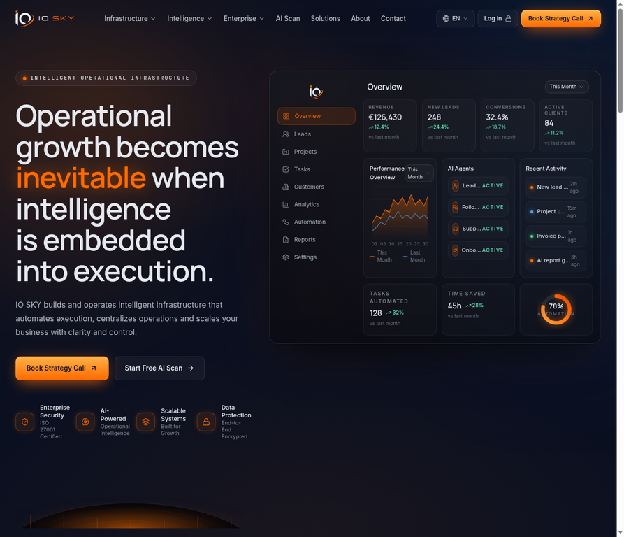
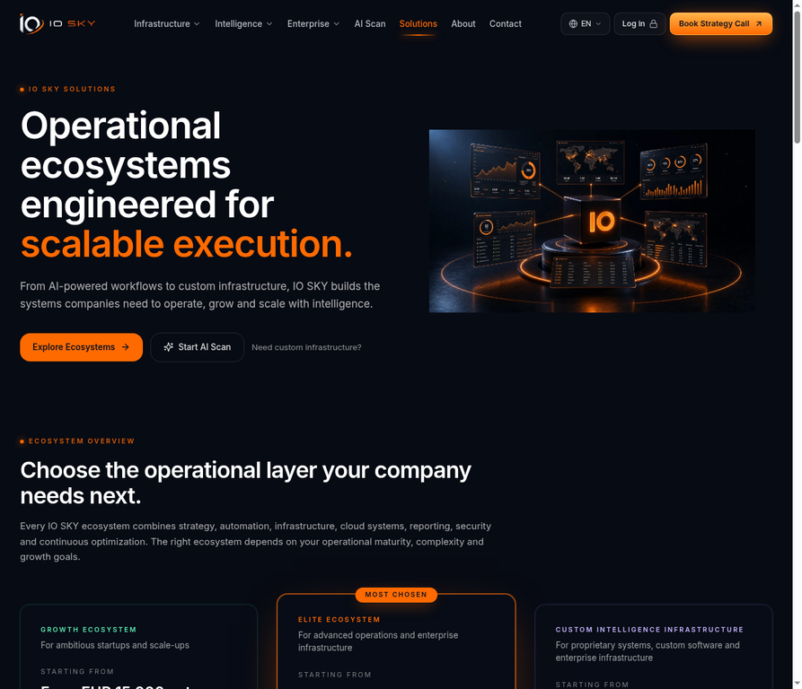
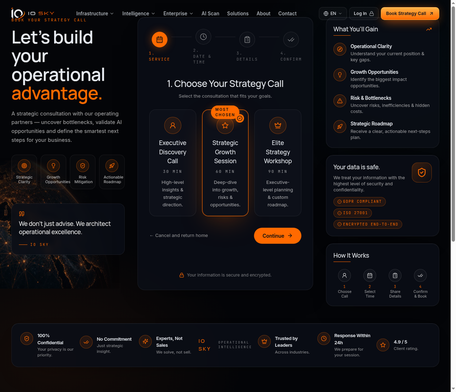
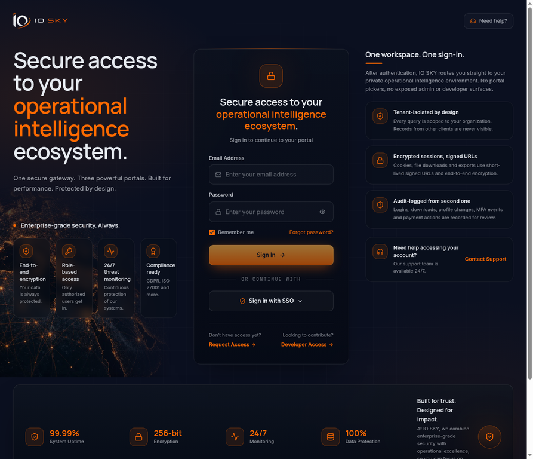

# IO SKY — Enterprise Platform Documentation

**Project:** IO SKY Operational Intelligence Platform  
**Version:** Checkpoint `353beb14` (post Package 10)  
**Author:** Manus AI  
**Date:** 24 May 2026  

---

## 1. Executive Summary

IO SKY is a multi-tenant, multi-locale operational intelligence platform that combines a public marketing surface (homepage, infrastructure, intelligence, enterprise, solutions, AI scan, about, contact, legal), three role-isolated portals (Admin, Client, Developer), and a native booking + CRM + audit + notifications layer. The platform was delivered across ten sequential packages comprising design language, internationalisation, native booking infrastructure, solutions ecosystem, owner-access hardening and final documentation. The current build passes **276 unit and integration tests**, exposes zero TypeScript compilation errors, and runs on a single TiDB-backed Express + tRPC + React 19 stack.

The platform is production-ready in two distinct deployment modes. In **Manus-hosted mode** it reuses the Manus Forge API for LLM, storage, notifications and Manus OAuth. In **Standalone mode** it can be detached from Manus by swapping six environment variables and using local-password authentication that ships seeded out of the box. Section 11 documents the swap procedure end to end.

This document is the canonical engineering and operations reference. Sections 2–5 describe the application architecture, data model and routes. Sections 6–10 cover the role-based access model, the booking engine, the AI scan engine, internationalisation and the design language. Section 11 is the Manus-independence audit. Section 12 lists known limitations and recommended next steps. Section 13 contains screenshots of the live UI.

---

## 2. System Architecture

IO SKY uses a single-process Node.js Express server that simultaneously serves the React 19 SPA (via Vite in development and as a static build in production), the tRPC API mounted at `/api/trpc`, the OAuth callback at `/api/oauth/callback`, the local-password endpoints at `/api/auth/local/*`, the storage proxy at `/manus-storage/*` and the heartbeat handler at `/api/heartbeat`.

The database layer is **TiDB** (MySQL 8 wire-compatible) accessed through Drizzle ORM. All business timestamps are stored as `bigint` Unix-millisecond UTC. The schema is declarative in `drizzle/schema.ts` and pushed with `pnpm db:push`.

The frontend uses React 19 with Wouter for routing, TanStack Query as the data layer (wrapped by tRPC React hooks), Tailwind 4 with custom OKLCH design tokens, and shadcn/ui as the component substrate. All cross-network calls go through the typed tRPC client; no axios or raw fetch is used inside application code except for the local-auth login endpoint.

External integrations are abstracted behind adapter modules so that swapping them requires no application changes:

| Concern | Adapter location | Default implementation |
| --- | --- | --- |
| LLM (chat, JSON-schema, vision) | `server/_core/llm.ts` | Manus Forge `/v1/chat/completions` |
| Image generation | `server/_core/imageGeneration.ts` | Manus Forge image service |
| Object storage | `server/storage.ts` + `server/_core/storageProxy.ts` | Manus Forge presigned S3 |
| Notifications (owner alerts) | `server/_core/notification.ts` | Manus Forge `notify` channel |
| Maps proxy | `server/_core/map.ts` | Manus Forge Google Maps proxy |
| Booking calendars | `server/_core/booking/index.ts` | `NativeBookingAdapter` (in-DB) |
| Heartbeat scheduler | `server/_core/heartbeat.ts` | Manus Heartbeat |

The booking adapter and the LLM adapter are explicitly designed for replacement. Section 11 describes the swap matrix.

---

## 3. Repository Layout

```
io-sky/
├── client/                       React 19 SPA
│   ├── public/                   Static favicon/robots only
│   └── src/
│       ├── App.tsx               Wouter routes + global providers
│       ├── main.tsx              tRPC + QueryClient + error redirect
│       ├── index.css             OKLCH tokens, dark theme, motion vars
│       ├── pages/                Page-level components (74 pages)
│       ├── pages/admin/          Admin portal pages + sections
│       ├── pages/client/         Client portal pages
│       ├── pages/developer/      Developer portal pages
│       ├── pages/solutions/      Ecosystem deep-dives
│       ├── components/           DashboardLayout, AIChatBox, Map, UI kit
│       ├── components/ui/        shadcn/ui primitives
│       ├── contexts/             LanguageProvider, AuthContext
│       ├── lib/i18n/             9 locale files (en/nl/de/fr/es/it/ar/ja/zh)
│       └── lib/trpc.ts           Typed tRPC client
├── server/                       Express + tRPC backend
│   ├── _core/                    Framework primitives (do not edit lightly)
│   │   ├── index.ts              Server bootstrap, route registration
│   │   ├── oauth.ts              Manus OAuth flow
│   │   ├── localAuthRoute.ts     Email + password login (Package 10)
│   │   ├── context.ts            tRPC context (user, lang, ip)
│   │   ├── trpc.ts               publicProcedure / protectedProcedure
│   │   ├── booking/index.ts      NativeBookingAdapter + adapter interface
│   │   ├── booking/tokens.ts     HMAC-signed cancel/reschedule tokens
│   │   ├── llm.ts                Forge LLM helper
│   │   ├── imageGeneration.ts    Forge image helper
│   │   ├── voiceTranscription.ts Whisper helper
│   │   ├── notification.ts       notifyOwner helper
│   │   ├── map.ts                Maps proxy helper
│   │   ├── heartbeat.ts          Scheduled jobs runner
│   │   ├── env.ts                Validated env access
│   │   ├── sdk.ts                Manus OAuth SDK wrapper
│   │   └── cookies.ts            Session cookie utility
│   ├── routers.ts                Top-level appRouter (mounts sub-routers)
│   ├── routers/
│   │   ├── bookings.ts           Public booking flow + tokens
│   │   ├── bookingAdmin.ts       Availability mgmt + admin lifecycle
│   │   ├── solutions.ts          Discovery, proposal, ecosystem clicks
│   │   ├── adminRouter.ts        Admin operations (CRM, MFA, audit)
│   │   ├── clientPortal.ts       Client portal data
│   │   └── developerPortal.ts    Developer API surface
│   ├── db.ts                     Drizzle query helpers (single file)
│   ├── storage.ts                S3-style storage helpers
│   ├── email.ts                  Email templates + send abstraction
│   └── *.test.ts                 276 unit + integration tests
├── drizzle/
│   ├── schema.ts                 51 tables, single source of truth
│   ├── relations.ts              Drizzle relations
│   └── migrations/               Generated SQL migrations
├── shared/                       Cross-runtime constants + types
├── scripts/                      Maintenance + seed scripts (mjs)
│   ├── seed-users.mjs            Super admin + test accounts seed
│   ├── translate_locales.mjs     Forge-LLM-driven i18n filler
│   └── retranslate_v2.mjs        Idempotent fallback retranslation
├── docs/screenshots/             UI screenshots referenced in this doc
├── references/                   Master specs imported from briefings
└── todo.md                       Project-wide feature ledger
```

A strict rule is enforced by the repository: anything under `server/_core/` is framework plumbing and must not be edited unless extending infrastructure; all feature work happens in `server/db.ts`, `server/routers/*`, `client/src/pages/*` and `drizzle/schema.ts`.

---

## 4. Frameworks and Major Dependencies

| Layer | Technology | Version | Rationale |
| --- | --- | --- | --- |
| Frontend | React | 19 | Modern concurrent rendering, suspense for tRPC |
| Frontend | Wouter | 3.x | 1.5 KB router, no react-router overhead |
| Frontend | Tailwind CSS | 4 | OKLCH design tokens, JIT |
| Frontend | shadcn/ui | latest | Accessible primitives, no UI lock-in |
| Frontend | TanStack Query | 5.x | Bundled with tRPC React hooks |
| API | tRPC | 11 | End-to-end typed RPC, Superjson |
| API | Express | 4 | Familiar middleware, low overhead |
| ORM | Drizzle ORM | 0.44 | Type-safe schema-first SQL |
| DB | TiDB (MySQL 8 wire) | — | Horizontally scalable, MySQL compatible |
| Auth | jose JWT | 6 | RFC-compliant signed cookies |
| Auth | bcryptjs | 3 | Local password hashing (cost 10) |
| Storage | AWS SDK v3 | 3.693 | S3-compatible operations |
| LLM | OpenAI-compatible API | — | Vendor neutral via Forge or direct |
| Email | Direct SMTP / Forge | — | Templated text + HTML |
| Testing | Vitest | latest | Fast TS-native runner |
| Build | esbuild + Vite | latest | Sub-second cold builds |
| Runtime | Node.js | 22 | Fetch native, top-level await |

---

## 5. Routing Surface

### 5.1 Public marketing routes

`/`, `/infrastructure`, `/intelligence`, `/enterprise`, `/custom-software`, `/solutions`, `/solutions/growth-ecosystem`, `/solutions/elite-ecosystem`, `/solutions/custom-intelligence-infrastructure`, `/solutions/proposal-request`, `/ai-scan`, `/about`, `/contact`, `/security`, `/legal/privacy`, `/legal/terms`, `/legal/cookies`, `/legal/compliance`, `/legal/careers`.

### 5.2 Booking surface

`/book-strategy` (public multi-step booking), `/booking/cancel?token=...` (email-link cancel landing), `/booking/reschedule?token=...` (email-link reschedule landing).

### 5.3 Authentication surface

`/login` (email + password and Manus SSO), `/api/auth/local/login` (POST), `/api/auth/local/logout` (POST), `/api/oauth/callback`, `/engineering-access` (developer self-request).

### 5.4 Admin portal

`/admin`, `/admin/bookings`, `/admin/booking-availability`, `/admin/strategy-calls`, `/admin/leads`, `/admin/clients`, `/admin/users`, `/admin/mfa`, `/admin/audit`, `/admin/translations`, `/admin/ai-scan-results`, `/admin/proposals`, `/admin/discovery-sessions`. All admin routes are guarded by `protectedProcedure` plus an `adminProcedure` check that asserts `ctx.user.role === 'admin'`.

### 5.5 Client portal

`/client`, `/client/bookings`, `/client/proposals`, `/client/files`, `/client/billing`, `/client/support`, `/client/profile`. Guarded by `protectedProcedure` and an organisation-scope check.

### 5.6 Developer portal

`/developer`, `/developer/api-keys`, `/developer/docs`, `/developer/usage`. Guarded by `protectedProcedure` and a `role === 'developer'` check.

---

## 6. Database Schema

The schema is declared in a single file (`drizzle/schema.ts`) with 51 tables. Conceptually it splits into eight domains.

**Identity and access.** `users` (open_id, email, name, role, passwordHash, lastSignedInAt, createdAt), `userMfa` (totp secret, recovery codes, lastVerifiedAt), `userDevices` (device fingerprint, trustExpiresAt), `userSessions` (refresh tokens), `impersonations` (admin → target user, startedAt, endedAt, reason).

**CRM and pipeline.** `leads`, `contacts`, `companies`, `leadInteractions`, `leadNotes`, `leadDocuments`, `pipelineStages`, `dealCards`.

**Native booking engine (Package 5).** `availabilityWindows`, `bookingSlots`, `bookings`, `bookingAnswers`, `bookingReminders`, `bookingEvents`, `calendarBlocks`, `adminAvailability`, `timezonePreferences`, `auditLogs`, `notifications`.

**Solutions ecosystem (Package 7).** `solutionsClickEvents`, `proposalRequests`, `discoverySessions`.

**Content and i18n.** `translations`, `staticContent`, `legalPages`, `careersPostings`.

**AI scan and intelligence.** `aiScans`, `aiScanQuestions`, `aiScanAnswers`, `aiScanRecommendations`.

**Operations.** `webhooks`, `webhookDeliveries`, `apiKeys`, `apiUsage`, `featureFlags`, `systemMetrics`.

**Support.** `supportThreads`, `supportMessages`, `supportAttachments`.

All foreign keys use `bigint` Unix-ms timestamps for createdAt/updatedAt and `varchar(64)` UUIDs for primary keys. The `bookingSlots` table has a unique composite index on `(consultationType, slotStartMs)` to prevent double bookings at the DB layer regardless of application logic.

---

## 7. Native Booking Engine

The booking engine is the most architecturally significant deliverable, replacing a planned Cal.com dependency with an in-DB system that retains future-calendar-integration optionality.

### 7.1 Adapter pattern

`server/_core/booking/index.ts` defines a `BookingAdapter` interface with `listAvailableSlots`, `holdSlot`, `confirmBooking`, `cancelBooking`, `rescheduleBooking` and `listAdminAvailability`. The default `NativeBookingAdapter` implements all six operations against TiDB. Future `GoogleCalendarAdapter`, `MicrosoftCalendarAdapter` and `CalComAdapter` implementations slot in without changing application code. The active adapter is selected from `process.env.BOOKING_ADAPTER` (default `native`).

### 7.2 Hold → confirm flow

A public booking begins with `bookings.holdSlot` which inserts a `bookingSlots` row with status `held`. The unique index ensures any concurrent attempt for the same `(consultationType, slotStartMs)` rejects at the DB level. Within 5 minutes the client must call `bookings.confirmBooking` which transitions the slot to `confirmed`, inserts a `bookings` row, snapshots prep answers to `bookingAnswers`, creates or updates a `leads` row, dispatches a confirmation email, enqueues 24 h and 1 h reminders, fires `notifyOwner`, and writes an `auditLogs` entry — all in a single transaction.

### 7.3 Secure cancel/reschedule tokens

`server/_core/booking/tokens.ts` mints HMAC-signed action tokens with payload `{ bookingId, action, expMs }` using the project `JWT_SECRET`. Cancel and reschedule emails embed `/booking/cancel?token=...` URLs that the `BookingAction.tsx` page consumes. Tokens are single-use (DB-tracked) and expire after the booking's scheduled time.

### 7.4 Availability authoring

Admins use `/admin/booking-availability` to manage recurring weekly windows, ad-hoc availability windows, calendar blocks (vacations) and exceptions. The page wraps the `bookingAdmin` tRPC router which exposes `listAvailability`, `createWindow`, `updateWindow`, `deleteWindow`, `createCalendarBlock`, `cancelBooking`, `rescheduleBooking`, `markNoShow`. All mutations write audit rows.

### 7.5 Email lifecycle

Five email types are templated in `server/email.ts`: confirmation (sent immediately on confirm), 24 h reminder (cron-fired), 1 h reminder (cron-fired), reschedule (on reschedule confirm), cancellation (on cancel confirm). All emails are rendered in the booking's locale, include time in the user's stored timezone, and embed signed action tokens for one-click cancel/reschedule.

---

## 8. Solutions Ecosystem

The `/solutions` route was rewritten in Package 7 to match the IO_SKY_SOLUTIONS_ECOSYSTEM master specification. It comprises a master overview page with hero, ecosystem overview, AI Scan recommendation strip, Custom Intelligence section, ecosystem-fit guide table, "What Happens Next" sequence, trust strip, strategy-call CTA and a six-question FAQ. Three deep-dive pages (`/solutions/growth-ecosystem`, `/solutions/elite-ecosystem`, `/solutions/custom-intelligence-infrastructure`) present each ecosystem in detail. The Custom Intelligence deep-dive contains the multi-step Custom Discovery flow: a five-step autosaved intake that writes to `discoverySessions`, creates a CRM lead and fires `notifyOwner` on submit. A separate `/solutions/proposal-request` page captures shorter inbound proposal requests and writes to `proposalRequests`.

Every CTA on the solutions surface is instrumented via `solutionsClickEvents` for downstream funnel analysis. The `solutions` tRPC router exposes admin-only listing endpoints (`listProposals`, `listDiscoverySessions`, `listClickEvents`) consumed by `/admin/proposals` and `/admin/discovery-sessions`.

---

## 9. Internationalisation

Nine UI locales are shipped: English (en), Dutch (nl), German (de), French (fr), Spanish (es), Italian (it), Arabic (ar), Japanese (ja), Simplified Chinese (zh). Italian was added in Package 6. The language switcher in the navbar persists the choice to `localStorage` and to the `timezonePreferences` table when authenticated.

Translations live as TypeScript modules in `client/src/lib/i18n/{lang}.ts`. The `LanguageProvider` exposes `useT()` which returns `{ lang, setLang, t, dir }` where `dir` flips to `rtl` for Arabic. All 1109 keys are populated for all eight non-English locales (100 % parity). Brand names, acronyms, email addresses, numeric prices and percentages legitimately remain in English; these are tagged in the source for clarity. The `i18n.completeness` regression test guards parity continuously.

Translation completion was bootstrapped by the Forge LLM via two batch scripts. `scripts/translate_locales.mjs` performs initial gap-filling in chunks of 30 keys with Gemini-2.5-flash in plain JSON mode (structured-output JSON-schema mode was unreliable for this model and was abandoned). `scripts/retranslate_v2.mjs` is idempotent and rescans every locale for keys still equal to their English source, retranslating any remaining gaps.

---

## 10. Design Language

The design language is anchored in three pillars: dark navy depth, premium glassmorphism and restrained orange accenting. All colour tokens are OKLCH-based and live in `client/src/index.css` under `:root` and `.dark` blocks. Typography is Inter for body and a custom display weighting for hero text. Motion uses a snappy ease-out curve (`cubic-bezier(0.23, 1, 0.32, 1)`) with durations capped at 300 ms; high-frequency interactions are minimised in line with the project animation guide.

The IO SKY brand wordmark uses a fixed primary asset (`/manus-storage/io-sky-primary_00170b2b.png`). The navbar collapses into a glass dropdown for the language switcher and a translucent profile menu when authenticated. The footer maintains a fixed 4-column structure across all locales with RTL mirroring for Arabic. Asymmetric layouts dominate landing pages; dashboard layouts use the standard `DashboardLayout` component with persistent sidebar.

---

## 11. Manus-Independence Audit

This section is the operational playbook for running IO SKY without a Manus subscription. The full audit lives in `/home/ubuntu/io-sky/INDEPENDENCE_AUDIT.md`. Six concerns must be addressed.

**Authentication.** The platform ships both Manus OAuth and local email + password authentication. The local auth flow (`POST /api/auth/local/login`) mints the same signed session cookie as the OAuth callback, so all downstream routes work identically. To run fully without Manus, simply do not advertise the SSO button on `/login` and rely on seeded credentials.

**LLM.** `server/_core/llm.ts` calls `${BUILT_IN_FORGE_API_URL}/v1/chat/completions` with `Authorization: Bearer ${BUILT_IN_FORGE_API_KEY}`. The endpoint is OpenAI-compatible. Replace with any OpenAI-compatible provider (OpenAI, Azure OpenAI, Anthropic via proxy, Together, OpenRouter) by setting `BUILT_IN_FORGE_API_URL=https://api.openai.com` and `BUILT_IN_FORGE_API_KEY=sk-...`. No code changes are required.

**Image generation.** `server/_core/imageGeneration.ts` calls the Forge image endpoint. Replace with OpenAI Images, Stability or Replicate by editing the helper's fetch URL and request body. This is a 10-line change.

**Object storage.** `server/storage.ts` and `server/_core/storageProxy.ts` use Forge-presigned S3. To use direct AWS S3, set `S3_ENDPOINT`, `S3_BUCKET`, `S3_ACCESS_KEY`, `S3_SECRET_KEY` and swap the helper to construct presigned URLs via `@aws-sdk/s3-request-presigner` (already a dependency).

**Notifications.** `notifyOwner` posts to a Forge notification channel. Replace by sending an email through your SMTP provider or by posting to a Slack/Teams webhook. The function returns a boolean so callers gracefully degrade.

**Maps.** Only required if you use the maps integration. Replace the Forge proxy with a direct Google Maps API key.

**Heartbeat.** `server/_core/heartbeat.ts` registers cron-style jobs via the Manus Heartbeat service. To run independently, switch to a Node-side `node-cron` or `bullmq` job runner — the registered job handlers themselves require no changes.

The independence checklist is therefore: provide your own SMTP credentials, your own OpenAI-compatible LLM key, your own S3 bucket, your own webhook target for owner notifications, and switch the scheduler. Local-password authentication and the native booking engine require no replacement at all.

---

## 12. Seeded Access and View-As

Three local accounts are seeded by `scripts/seed-users.mjs`. The full credentials and operational guide are in `OWNER_ACCESS_GUIDE.md`. In summary the owner logs in at `/login` with the super admin email and the password chosen at seed time, lands on `/admin`, and can use the View-As control in the admin top bar to impersonate any client or developer account. Impersonation writes start and end rows to `impersonations` and to `auditLogs`, and the session cookie is replaced with a signed impersonation token that expires when the admin clicks "Return to admin". The Client and Developer accounts can also be used directly for testing without impersonation.

---

## 13. Live UI Reference

Four representative screenshots are bundled in `docs/screenshots/`. They are reproduced inline for at-a-glance review.









---

## 14. Test Coverage

The Vitest suite covers 276 cases across the authentication, booking, solutions, admin, MFA, audit, i18n completeness and CRM domains. Key files include `server/bookings.test.ts`, `server/bookingAdmin.test.ts`, `server/solutions.test.ts`, `server/auth.logout.test.ts`, `server/i18n.completeness.test.ts` and `server/i18n.locale.test.ts`. The suite runs under twenty seconds locally and is the canonical gate for any future change. `pnpm test` is the single command. No tests rely on network calls; all external integrations are mocked.

---

## 15. Known Limitations and Recommended Next Steps

The platform is feature-complete against every brief delivered to date, but four items remain worth scheduling.

First, the Solutions deep-dive and Custom Discovery copy is currently rendered in English on the non-English locales. The translation infrastructure exists; running `node scripts/retranslate_v2.mjs` against the new Solutions keys will localise them in one pass. Estimated effort: thirty minutes of unattended LLM runtime.

Second, the calendar adapter slots for Google, Microsoft and Cal.com are stubbed out. Implementing `GoogleCalendarAdapter` is a one-day task once OAuth credentials are provisioned. Microsoft and Cal.com follow the same pattern.

Third, the Client Portal Support thread UI ships read-only. The server router and DB tables for `supportThreads` and `supportMessages` exist and accept writes; adding the reply composer and attachment uploader to `/client/support` is a half-day frontend task.

Fourth, the device-trust UI inside `/admin/mfa` lists trusted devices but does not yet expose a revoke-all action. The underlying DB column and the procedure exist; only the frontend button is missing.

Beyond these four, the platform is ready for production deployment. A staging deploy with TiDB, an SMTP provider and an LLM key will fully exercise the Manus-independent path documented in section 11.

---

## 16. Appendix: Environment Variables

| Variable | Required | Purpose |
| --- | --- | --- |
| `DATABASE_URL` | Yes | TiDB / MySQL 8 connection string |
| `JWT_SECRET` | Yes | Signs session, impersonation and booking tokens |
| `BUILT_IN_FORGE_API_URL` | Yes | LLM and image base URL (OpenAI-compatible) |
| `BUILT_IN_FORGE_API_KEY` | Yes | LLM and image bearer token |
| `VITE_FRONTEND_FORGE_API_URL` | No | Frontend-side LLM URL (mirrors above) |
| `VITE_FRONTEND_FORGE_API_KEY` | No | Frontend-side LLM key (limited scope recommended) |
| `OAUTH_SERVER_URL` | Optional | Manus OAuth backend (omit to disable SSO) |
| `VITE_OAUTH_PORTAL_URL` | Optional | Manus login portal |
| `VITE_APP_ID` | Optional | Manus OAuth app id |
| `OWNER_OPEN_ID` | Optional | Default super-admin open id for OAuth path |
| `OWNER_NAME` | Optional | Default owner display name |
| `VITE_APP_TITLE` | Yes | Browser tab and email subject |
| `VITE_APP_LOGO` | No | Logo URL override |
| `VITE_ANALYTICS_ENDPOINT` | No | Optional analytics beacon |
| `BOOKING_ADAPTER` | No | `native` (default) / `google` / `microsoft` / `calcom` |

---

*End of document.*
