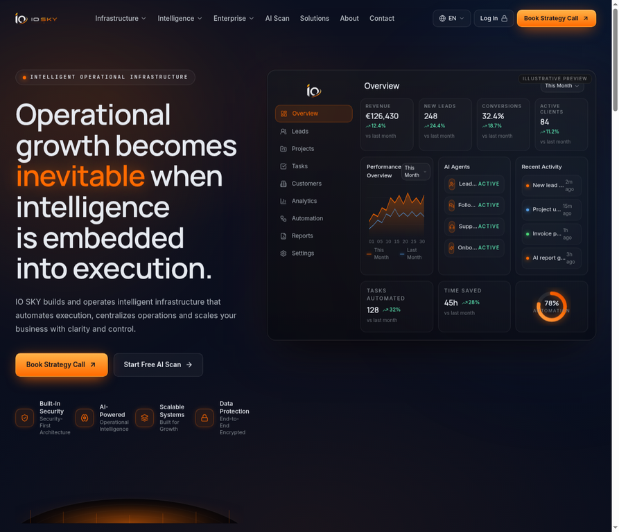
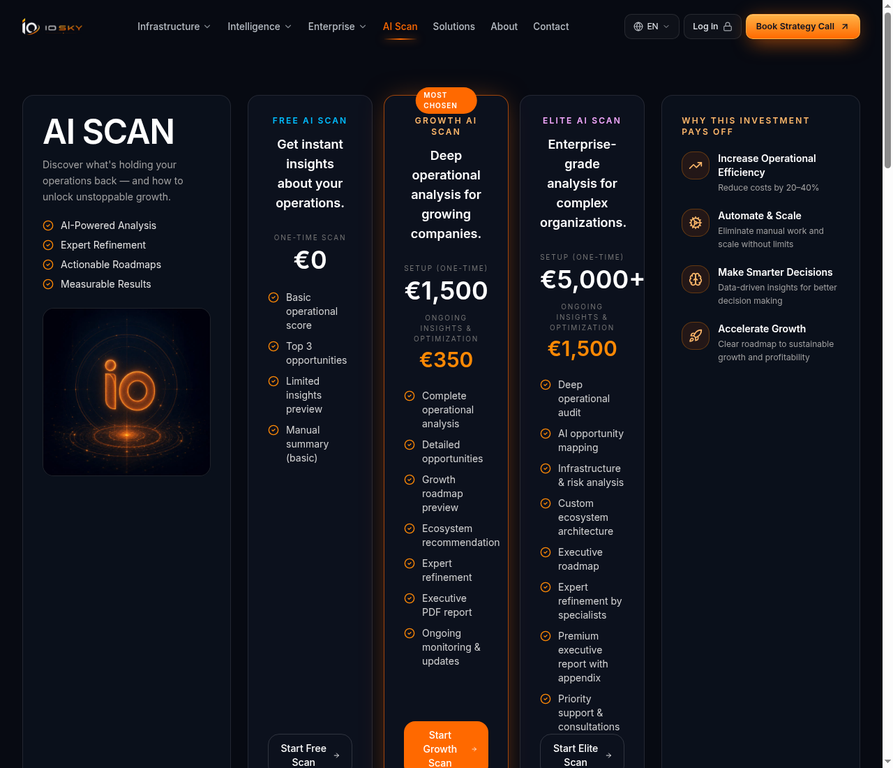
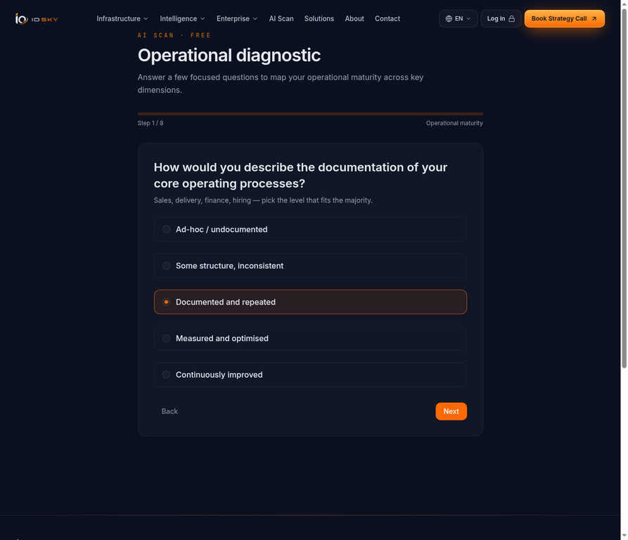
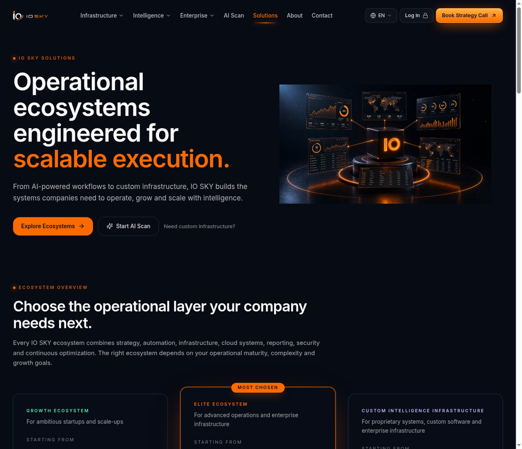
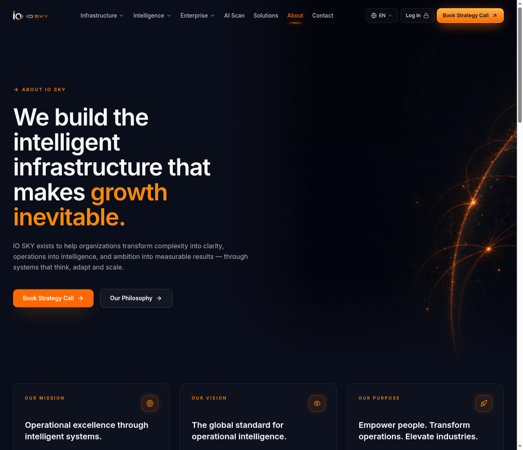

# IO SKY — Ultra Blueprint (Launch-Ready)

This is the consolidated, launch-ready blueprint for the **IO SKY** platform: an intelligent operational-infrastructure product comprising a public marketing site, a multi-tier AI Scan diagnostic, and gated client, developer and admin portals. It captures the production architecture, the feature surface, the honesty and security measures completed in the final hardening round, and the current verified state of the build. Screenshots in this document are captured from the running staging build, not mockups.

---

## 1. What IO SKY Is

IO SKY positions itself as an operational-infrastructure partner: it builds and operates the CRM, automation, data-visibility, integration and intelligence layers that growing companies need in order to scale execution. The public site communicates that value proposition and routes prospects into two primary conversion paths — a **Strategy Call** and a self-serve **AI Scan**. Behind authentication sit three operational surfaces: a **Client Portal**, a **Developer Workspace** (API access), and an **Admin Infrastructure** console.

The platform is built on a single React 19 + tRPC 11 + Express + Drizzle/MySQL stack with Manus OAuth, server-side LLM access, S3-compatible storage, and a localisation layer spanning ten locales (English, Dutch, German, French, Spanish, Italian, Arabic with full RTL, Simplified Chinese, and Japanese).

---

## 2. Public Site — Home

The landing page leads with the core narrative ("Operational growth becomes inevitable when intelligence is embedded into execution") and a clearly-labelled **Illustrative preview** of the operational dashboard. The dashboard figures are explicitly framed as a preview rather than presented as live customer metrics, which keeps the marketing surface honest for a pre-launch product.

The top navigation exposes the full capability taxonomy (Infrastructure, Intelligence, Enterprise), the AI Scan, Solutions, About and Contact, plus the live language switcher and the two conversion CTAs. The transparent-background logo is used consistently across the header, footer, loader and favicon.

---

## 3. AI Scan — Tiers

The AI Scan is the product's signature self-serve diagnostic. It is offered in three tiers — a free one-time scan, a Growth tier, and an Elite tier — each with clearly itemised deliverables and transparent setup/ongoing pricing. All three tiers route into the same questionnaire; billing for paid engagements is handled offline after the scan and strategy call (no Stripe paywall is active in staging).

---

## 4. AI Scan — Diagnostic Flow

The questionnaire walks the prospect through eight steps spanning operational-maturity dimensions, with focused prompts and helper text. All prompts, helper strings and page chrome are fully localised across the ten supported locales; the flow falls back to English where a translation is unavailable. On completion the scan is scored, an operational score and grade are produced, and a branded PDF report can be generated and downloaded through a token-gated endpoint.

---

## 5. Solutions & Ecosystems

The Solutions page presents three engagement models — the Growth Ecosystem, the Elite Ecosystem, and Custom Intelligence Infrastructure — each scoped by operational maturity and complexity, with transparent starting prices and a clear FAQ addressing pricing, data hosting, integrations and onboarding speed.

---

## 6. About — Honest Capability Framing

The About page was revised in the final hardening round to remove fabricated track-record metrics (previously "250+ organisations", "1.2M+ processes", "99.9% uptime delivered", "47% efficiency"). It now communicates the company's engineering approach and capabilities in honest, non-quantified terms appropriate for a pre-launch business.

---

## 7. Authentication & Portals

Authentication uses Manus OAuth with a session cookie, layered with a local credential path and multi-factor authentication (TOTP and SMS) for sensitive roles. Three gated surfaces exist:

| Surface | Audience | Purpose |
| --- | --- | --- |
| Client Portal | Customers | Operational visibility, documents, scan results |
| Developer Workspace | API consumers | API keys, usage, developer security (MFA) |
| Admin Infrastructure | IO SKY operators | CRM leads, organisations, module previews, admin security (MFA) |

Role separation is enforced server-side via `ctx.user.role` and an `adminProcedure` guard. The newly-added **Admin Security Center** lets operators enrol an authenticator app or SMS factor, manage factors, regenerate recovery codes and sign out, all through the portal-agnostic `mfa.*` procedures with server-side audit logging.

---

## 8. Honesty & Data-Integrity Measures

A core principle of the final round was that nothing on the surface should imply data, customers or guarantees that do not exist:

- **Sample-data badges.** The genuinely synthetic admin modules (Security, Campaigns, Agents, Automations, Analytics) carry a visible "Sample data · module preview" badge. Database-backed modules remain unbadged.
- **Real lead sources.** CRM "Top sources" are derived from actual lead-source records rather than invented figures.
- **Claims sweep.** All fabricated uptime percentages, customer counts, efficiency figures and the invented "4.9 / 5" rating were replaced with honest capability/architecture language or a clearly-labelled disclaimer. The Results section now reads "TARGET OUTCOMES" with an explicit illustrative-outcome disclaimer.
- **No dead CTAs.** Placeholder `href="#"` social links were removed in favour of a config-driven row that stays hidden until real accounts exist.
- **Demo-entity naming.** The demo organisation no longer implies a registered legal entity ("B.V." removed from emails and seed data).

---

## 9. Localisation

The platform ships ten locales with enforced parity: English is the authoritative superset, every other locale must cover all English keys, and a completeness test guards against drift. Transactional emails (booking, contact, engineering-access) are localised end-to-end including right-to-left rendering for Arabic and locale-specific date formatting, with the active UI language passed from the frontend on submission.

---

## 10. Operational Readiness

The build is gated for staging behind a password wall (`STAGING_MODE` + `STAGING_PASSWORD`) so the site can be shared privately before launch. Seeded test accounts can be disabled, rotated or removed with a dedicated cleanup script before go-live. A branded AI Scan PDF export is available and cached per scan. The full automated test suite passes (364 tests across 28 files) with a clean TypeScript compile.

Detailed runbooks accompany this blueprint:

- `IO_SKY_STAGING_OPERATIONS.md` — staging gate, seeding/cleanup, PDF export, Stripe activation path.
- `IO_SKY_DOMAIN_BINDING_HANDBOOK.md` — custom-domain purchase/binding, DNS, SSL, OAuth implications.
- `MANUS_INDEPENDENCE.md` — every Manus runtime dependency and its migration path to an independent host.
- `IO_SKY_DEVELOPER_HANDOFF.md` — codebase orientation, build loop, schema, and where to extend.

---

## 11. Verified State at Authoring Time

| Check | Result |
| --- | --- |
| TypeScript compile | Clean (0 errors) |
| Automated tests | 364 passed / 364 (28 files) |
| i18n parity | English superset, no orphan keys |
| Logo treatment | Transparent PNG everywhere |
| Fabricated metrics | Removed / reframed |
| Staging gate | Functional |

This blueprint reflects the platform exactly as built and verified on the authoring date above.
